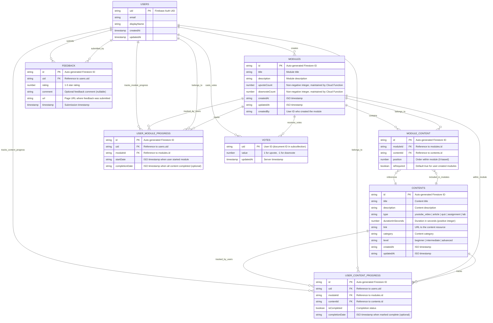

# StudAI Database Model - Mermaid Diagram

Based on the comprehensive analysis of all specs in `.kiro/specs`, here is the complete data model for the StudAI application:

## Key Design Decisions & Relationships

### 1. **Content Management**

- **Contents**: Standalone learning resources with metadata, duration tracking, and YouTube video support
- **Modules**: Collections of ordered content items with voting capabilities
- **Module-Content Relationship**: Many-to-many through `MODULE_CONTENT` junction table with position ordering

### 2. **Progress Tracking**

- **Two-Level Progress**: Module-level (`USER_MODULE_PROGRESS`) and content-level (`USER_CONTENT_PROGRESS`)
- **Explicit Start**: Users must explicitly start a module before progress tracking begins
- **Completion Timestamps**: Both module and content completion dates are tracked

### 3. **Voting System**

- **Subcollection Design**: Votes stored as subcollection under modules (`modules/{moduleId}/votes/{uid}`)
- **Server-Side Integrity**: Vote counts maintained by Cloud Functions to prevent tampering
- **One Vote Per User**: Document ID is the user's UID, ensuring single vote per user per module

### 4. **User Feedback**

- **Contextual Capture**: Automatically captures page URL and user ID
- **Optional Comments**: Star rating required, comments optional
- **Global Feedback**: Not tied to specific modules/content, allows general app feedback

### 5. **Security & Data Integrity**

- **User Ownership**: Progress and votes tied to authenticated users
- **Firestore Rules**: Enforce user can only access their own progress/votes
- **Server-Side Validation**: Cloud Functions ensure vote count accuracy
- **Optimistic Updates**: UI updates immediately with server reconciliation

### 6. **Content Duration & Metadata**

- **Duration Tracking**: Content duration in seconds for time estimation
- **Metadata Extraction**: Preview metadata fetched from content URLs
- **Flexible Content Types**: Support for various content types (videos, articles, quizzes, etc.)

### 7. **Navigation & User Experience**

- **Module Context**: Content viewing maintains module context for navigation
- **Progress Indicators**: Visual feedback for completion status
- **Breadcrumb Navigation**: Support for hierarchical navigation
- **Language Support**: i18n ready with locale-specific content

This data model supports all the features specified in the requirements while maintaining data integrity, security, and scalability for the StudAI learning platform.
